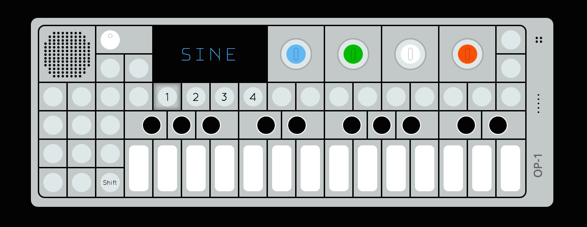

# OP-1 Synthesizer

</img>

A *very* lightweight version of Teenage Engineering's OP-1 Synthesizer built with React and Redux

## Features
- Four different oscillator types (Sine, Sawtooth, Triangle, Square)
- Keyboard functionality
- Built in volume control

## TODO
- Optimize keyboard listener
- Animate waveform of oscillator(s) on the display
- Allow users to stack osciallators
- Fix mouse functionality
- Add a drum pad
